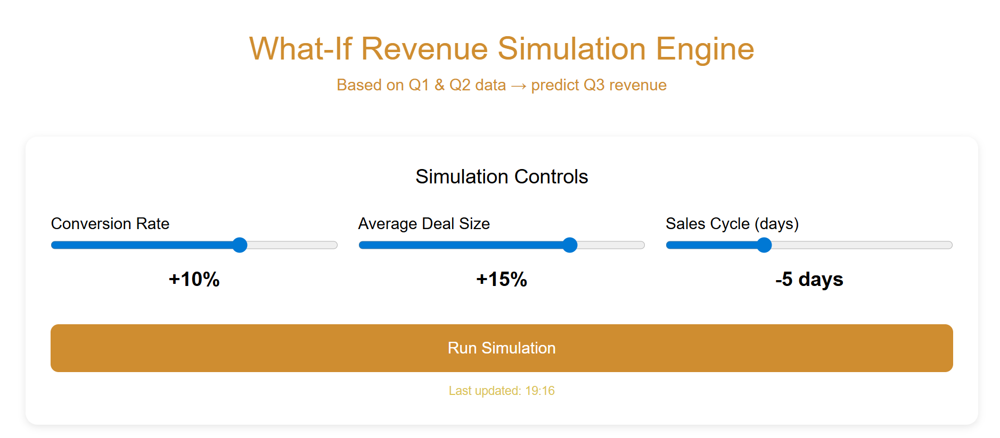
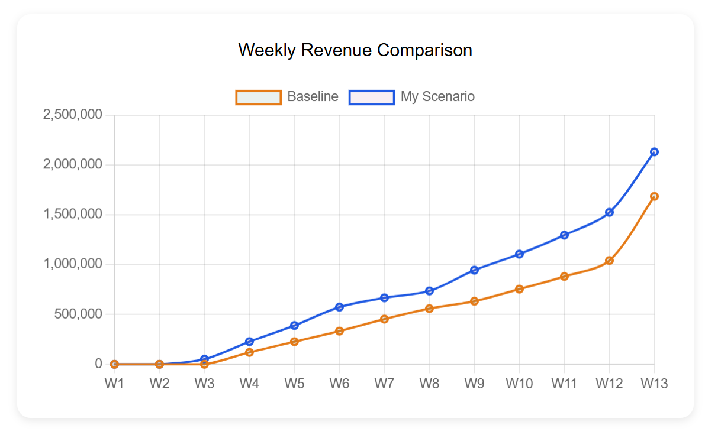
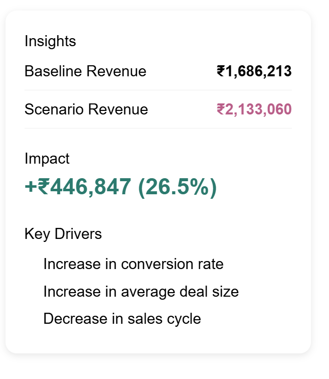
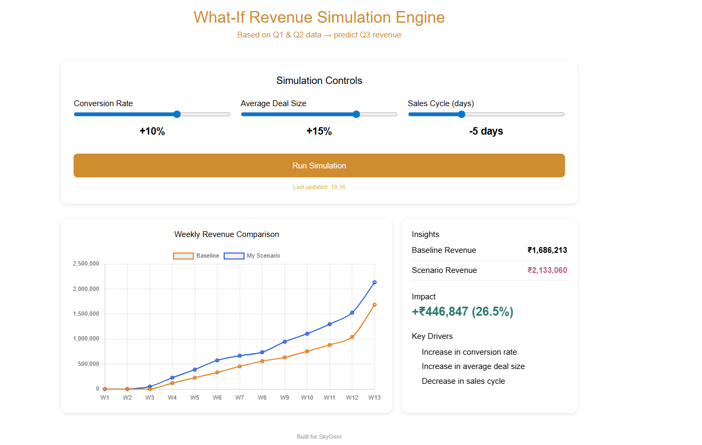

What-If Revenue Simulation Engine

A full-stack tool to simulate **Q3 revenue** using Q1 & Q2 sales data, with real-time “what-if” controls for conversion rate, deal size, and sales cycle.
Built for the SkyGeni Full Stack Internship Assignment.

-------------------------------------------------------------------------------------------------------------------------------------------------------------------

## Overview

Instead of showing past dashboards, this project focuses on predicting future revenue.

You can tweak conversion rate, average deal size, and sales cycle duration — and instantly see how revenue changes.

-------------------------------------------------------------------------------------------------------------------------------------------------------------------

## How it works

**Data split:**

* Q1 & Q2 → used to calculate baseline
* Q3 → treated as open pipeline for simulation

**Baseline metrics:**

* Conversion = Closed Won / (Closed Won + Closed Lost)
* Avg Deal Size = avg(deal_value of Closed Won)
* Sales Cycle = avg(closed_date − created_date)

**Fallbacks (if data missing):**

* conversion → 0.5
* deal size → 15000
* sales cycle → 30 days

**Simulation logic:**

* revenue = deal_value × conversion × size multiplier
* close date = created_date + adjusted sales cycle
* output mapped across 13 weekly buckets (cumulative)

-------------------------------------------------------------------------------------------------------------------------------------------------------------------

## API

**GET -> /api/metrics**
Returns baseline metrics

**POST -> /api/simulate**

json
{
  "conversionChange": 10,
  "dealSizeChange": 15,
  "salesCycleChange": -5
}

Returns:

* baseline vs scenario revenue
* total impact (₹ and %)
* key drivers of change

-------------------------------------------------------------------------------------------------------------------------------------------------------------------

## Frontend and Backend

Built with React + Chart.js + TypeScript

* sliders for all 3 inputs
* auto simulation (debounced)
* manual run option
* live updates + timestamp

-------------------------------------------------------------------------------------------------------------------------------------------------------------------

## Visualization

Single chart (as required):

* baseline vs scenario
* weekly → cumulative revenue
* W1–W13 vs ₹

-------------------------------------------------------------------------------------------------------------------------------------------------------------------

## Demo

https://www.loom.com/share/c6e4b7c81c804455a217c61519e54d07

-------------------------------------------------------------------------------------------------------------------------------------------------------------------

## Screenshots

-------------------------------------------------------------------------------------------------------------------------------------------------------------------

## Project Structure

backend/

frontend/

screenshots/

video/

README.md

-------------------------------------------------------------------------------------------------------------------------------------------------------------------

## Run locally

git clone https://github.com/anurag-yv/What-If-Revenue-Simulation-Engine.git                                                                           

cd WHAT-IF REVENUE SIMULATION ENGINE

...................

**Backend**

cd backend

npm install 

npm run build

npm start

.....................

**Frontend**

cd frontend 

npm install

npm run dev

-------------------------------------------------------------------------------------------------------------------------------------------------------------------

## Assumptions

* Q1–Q2 define baseline
* Q3 is open pipeline
* uniform conversion applied
* linear sales cycle adjustment
* revenue shown cumulatively

-------------------------------------------------------------------------------------------------------------------------------------------------------------------

## Key takeaways

* conversion has the biggest impact
* deal size scales revenue directly
* shorter cycle shifts revenue earlier
* combined changes amplify results

-------------------------------------------------------------------------------------------------------------------------------------------------------------------

##Author

Anurag Yadav

LinkedIn: https://www.linkedin.com/in/anurag-yv/                                                                                                                  
GitHub: https://github.com/anurag-yv

-------------------------------------------------------------------------------------------------------------------------------------------------------------------

⭐ If you found this useful, consider starring the repo.
